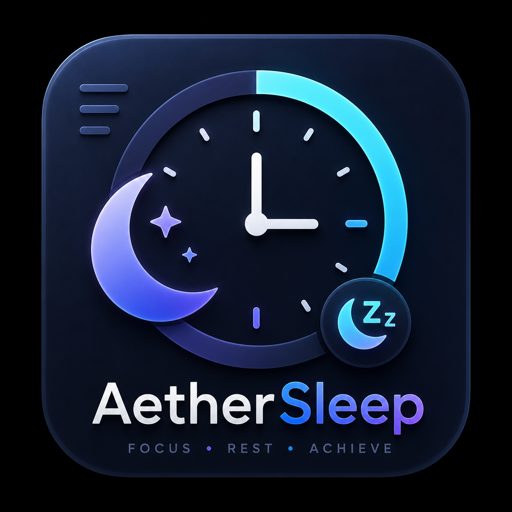

  

<h1 align="center">Aether Sleep</h1>

  <strong>Advanced Smart Hibernation & Shutdown Timer for Windows</strong>

  <a href="#features">Features</a> •
  <a href="#installation">Installation</a> •
  <a href="#usage">Usage</a> •
  <a href="#smart-trigger">Smart Trigger</a>

---

## 🌌 Overview

**Aether Sleep** is a premium, lightweight, and incredibly smart power-management utility for Windows. 
Unlike standard sleep timers, Aether Sleep features a **Smart Trigger** system that monitors your computer's network activity or CPU usage. It will wait for your heavy downloads to finish or your intensive rendering tasks to complete before safely putting your computer to sleep or shutting it down.

Built with an elegant, modern **Glassmorphism** UI, it feels right at home on modern desktop environments while remaining extremely resource-efficient.

## ✨ Features

- 🕒 **Quick & Custom Timers**: Set a timer with 1-click presets or input custom minutes.
- 🧠 **Smart Trigger**: 
  - **Network Monitoring**: Wait until your download speed drops below a certain threshold (e.g., waiting for a Steam game download to finish).
  - **CPU Monitoring**: Wait until CPU usage drops (e.g., waiting for a video render to complete).
- 🎨 **Beautiful UI**: Glassmorphism design with 15+ dynamic color themes (Cyberpunk, Sunset, Sakura, etc.).
- 🎵 **Audio Fade-Out**: Automatically lowers your system volume gradually before sleeping.
- 🛡️ **Sleep Prevention**: Temporarily prevents Windows from auto-sleeping while the timer is running.
- ⏰ **Auto-Wake (BIOS)**: Set a specific time for your computer to wake up automatically.
- 💾 **Smart Memory**: Remembers your last used settings, actions, and custom times.
- 🕹️ **Quick Hide**: Press `ESC` to quickly minimize the app to the System Tray.
- 🔔 **Discord Integration**: Sends a Discord webhook notification right before your PC goes to sleep.

## 🚀 Installation

1. Go to the **[Releases](../../releases)** page.
2. Download `AetherSleep_v1.0_Setup.exe`.
3. Run the installer and follow the Setup Wizard.
4. Launch **Aether Sleep** from your Desktop or Start Menu!

## 💡 How to Use the Smart Trigger

The Smart Trigger is the core feature of Aether Sleep. Here is how to use it for downloading large files:

1. Open Aether Sleep.
2. Under the action dropdown, select **Hibernate (Smart)** or **Shutdown (Smart)**.
3. A new panel will appear. Set the trigger to **Network (Download)**.
4. Set the threshold to something low, e.g., `500 KB/s`.
5. Set the duration to `5 Menit`.
6. Click **Start Sleep**.

*Aether Sleep will now monitor your download. Once your download finishes (and the speed drops below 500 KB/s for 5 continuous minutes), it will execute the shutdown/hibernate command!*

## 🛠️ Built With

- **Python** (Backend logic, OS integration, `psutil`, `pycaw`)
- **HTML/JS/Vanilla CSS** (Frontend UI, Glassmorphism aesthetics)
- **Eel** (Bridging Python and JS seamlessly)

## 📄 License

This project is licensed under the MIT License - see the [LICENSE](LICENSE) file for details.
